# Git

## 1 我会怎么讲解 

此处不详细讲解Git指令（详细指令可自行搜索，我使用的是“[菜鸟文档](https://www.runoob.com/git/git-tutorial.html)”的文档，十分不完整，但足够使用），也不会详细讲解如何登录Git，或下载Git，这在你搜寻Git教程时，都是好解决的问题。

所以本教程，是建立在你有如下基础上（看完菜鸟文档就能达到）：

1. 了解Git基础指令
2. 成功安装Git
3. 成功登录Git

我此处着重讲解的是：**如何使用Git来管理自己不断迭代的项目。**

首先对“管理自己不断迭代的项目”这句话进行讲解。

* 管理，是使用Git进行一些列操作；
* 不断迭代，是指一个项目，尤其是大型项目，会经历多个版本，而一个一个版本不断的更新的过程，就叫迭代。

尽管你可能听到过“Git的分支管理”、“Git的三个分区”等概念（没听过也完全没关系，因为我会用简洁又好理解的方式向你讲解），但我想你应该也和笔者初学Git时一样，在听过这些概念后，尽管了解，但却没有一个好的方法去使用。

因此此教程着重讲解的，就是如何使用上Git的这些功能。

由于许多教程对概念解释的又臭又长，却不教如何使用，所以我写该教程的初衷，就是来填补上该漏洞，或者说真正实现，让看本教程的读者能不必经历12+h视频教程的艰苦学习过程。

Git本该是好学习，好理解，好使用的优秀工具。

我观看了网上许多的资料，视频也好、文档也好，写的都不符合我们自小使用图形化界面的思维，因此我在此使用图形化的思维，对Git进行的一系列非图形化操作进行讲解。（图形化就是对非图形化进行的封装）

## 2 Git的两大功能

我们首先要了解，我们使用的Git，有两大块功能

* **管理本地的版本库**
* **管理远程的版本库**

我们此处先不进行讲解什么是版本库，到后面会进行讲解。

我们首先讲解，**Git是如何管理本地版本库的**。

## 3 Git的第一步：建立仓库

当我们看了Git文档后，会了解到，Git的第一步，是建立仓库，或者说工作区，或者等等叫法，都没关系。

我们为什么要建立仓库呢？

这是因为我们可能不止在开发一个项目，或者说，我们一定会开发多个项目，而多个项目由一个Git进行管理，当然不是不可以，但会导致“分支”不清晰，分支是什么概念，我们等下在讲。笔者更喜欢每个项目单独建立一个Git仓库，也建议使用Git的人都如此。

我们建立一个Git仓库，它究竟做了什么呢？

其实就是在一个文件夹内，配置了Git文件，该文件对该文件夹层下的所有文件进行管理，再说白一点，**Git在你进行git init的文件夹内，装了一个“.git”的隐藏文件。**

当我们完成了这一步，就可以讲，完成了Git的初始化，也可以叫做把Git的工作区建立完成，也可以叫做把该文件夹下的文件都交由Git管理。

## 4 Git是如何管理我们的项目的

当我们建立了Git的仓库后，就需要Git来点作用了。

但在这之前，我们还需要了解Git是如何管理我们项目的。

Git，把本地的文件夹按照一种模式管理了起来，而这种模式，就是建立三个分区，三个分区分别是**工作区，暂存区，版本库**。

三者的关系是什么呢？

* **我们在工作区进行开发**，换句话说，你写了一些代码，或者新建了一些文件，都是在工作区进行的，这很符合我们的认知。
* 而暂存区，就是于对工作区进行了一次保存，只不过，它把是把你工作区中选定的文件，全都原封不动的，复制了一份到暂存区（并不是真的复制，那样文件就太大了，它实际保存的是一个能记录你对文件进行了什么操作的文件，但理解时， 你可以理解为就是分别复制了一份到暂存区）。

这样有什么好处呢，或者讲，我们为什么要这样做呢？是因为我们等下还要把缓存区的文件，上传到版本库（上传就是刚刚所讲的从一个区复制你选定的文件到另一个区，我们称这种行为叫上传，向上传递）。

**因此，暂存区，顾名思义，就是当你在工作区对文件修改到满意后，暂时存放的这么一个位置。**而暂存区再向版本库上传时，就到了Git是如何管理我们的项目的这么一部分了。

> **该处引用，对于未学过Git的读者，笔者强烈建议忽略，因为此处讲到了一些你未了解或明白的概念，会混淆你接下来的学习。**
>
> 学过Git，又来看本教程的读者，可能与笔者初学Git时一样会混淆一个概念，那就是还有一个远程仓库，也就是GitHub，它与这三个分区又是什么关系。我将在此处进行讲解。  
>   
> 简单来讲，你本地的项目，有且仅有这三个分区，并且这三个分区，都在你的电脑上，而GitHub，我在此处把它叫做远程分区，你可以这样理解，你是把你的版本库分区，上传到了GitHub，也就是远程分区上。和你把暂存区上传到版本库分区没什么区别，只是远程分区不在你的电脑，而在别人电脑上（也就是GitHub的服务器）。  
>   
> 换句话说，如果你只在本地使用Git，那么你根本不需要GitHub，或者说远程分区。  
>   
> 如果看到此处，仍旧对远程分区有什么用，或者为什么要有远程分区，有些疑惑，也是正常的，因为本来GitHub与Git就不能一概而论。你可以通过我对GitHub的讲解，结合案例，来彻底搞明白，Git和GitHub的关系。

### 4.1 分支

如果你看过Git的教程，会了解到分支这个概念，而分支，就是Git管理我们项目的关键。

我们创立一个Git仓库时，会自动的建立一个Master分支，那么分支是什么呢？

你可以这样理解，一条分支，就是一条时间线，你在这条时间线上，进行的操作，都会被时间线记录下来。例如：你新建了一个A文件，并修改了里面的值，写代码也好，改名字也好，总之就是进行了一些列操作，那么这个分支上，在你把你进行了一系列操作并且保存在暂存区的文件，上传到版本库时，你进行的这些操作，就会被记录下来。并在一个分支上显示，显示的方式是把你对这些操作的描述保存在你提交的那个时间点上。

我们通常的流程是这样的：

1. 修改了A文件，
2. 把A文件上传到暂存区，感觉没问题了，可以加入版本库，
3. 就把暂存的该文件上传到版本库，并对这个文件进行讲解，进行讲解就是指你对这个文件加个注释，好便于知道自己都做了什么。

### 4.2 分支的分类

如果我们所有的操作，都在一条分支上进行记录，就有些浪费分支这个功能，那么分支可以分出多条，我们该如何使用呢？

我们把分支进行了分类，分别是：

* 已经创建好的主分支Master（当然这条不必自己创建）
* 开发分支Developer
* 用于测试的内部发布版分支Release
* 开发功能的feature分支
* 随时需要，随时创建的修改Bug的分支Hotfix。

我们通过在不同的分支上进行不同的开发（就是写代码），就能实现十分便利的，对版本更迭的管理。

### 4.3 怎么在不同的分支上进行不同的开发？

上面对分支是什么，分支的分类进行了讲解，但可能你仍旧不了解如何使用分支进行开发，这是正常的。

在此处我将进行讲解**如何利用多条分支来实现本地项目的多版本迭代**。

在此处，我会通过讲解一个案例，来向你说明如何在不同分支上进行不同开发，并回顾之前对Git的讲解。

值的提到的是，你当然可以使用Git提供的Git Bash，但因为笔者不喜欢不可视，或者说学习成本更高，所以案例在VScode中进行。同时笔者也建议，使用VScode编译器的读者，使用VScode的Git扩展插件来完成对本地项目的管理。因为这在我看来，更方便一些。

当然我也会提到如果使用指令，因为我们在服务器部署时，没有这个插件可用。

### 4.4 一个Git管理本地项目的案例

在一切开始前，我们先在VScode中安装Git Graph插件。

#### 4.4.1

首先我们要在TestGit文件夹中初始化了Git仓库，所以，我们的所有操作，都是在TestGit这个文件夹中进行的。此时我们也可以称TestGit是一个项目。（一个项目放在一个文件夹内）  
用VScode来操作如下图，我们首先在VScode打开这个项目的文件夹，然后进行下面操作：

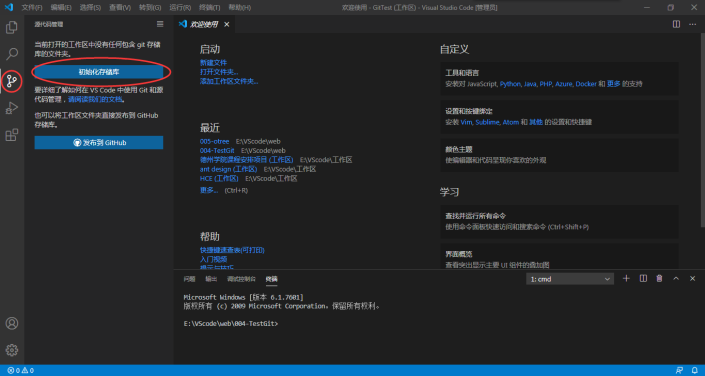

#### 4.4.2

此时，我们可以看到，我们就处在Master分支中，你可以在你的VScode编译器的左下角看到。

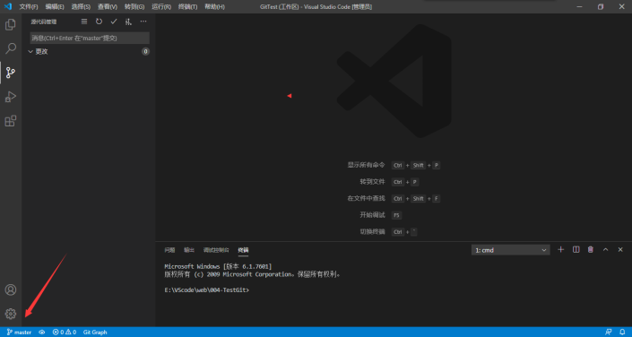

#### 4.4.3

此时我们就可以引入多分支的概念了，让我们先看一张图：  
这就是分支的概念，也是分支的使用方式，接下来，我们就在VScode中完成这一系列的操作，并且我会讲解他们分别做了什么，为什么这么做。

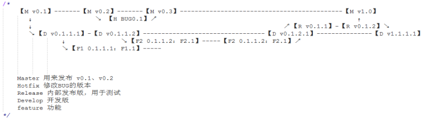

#### 4.4.4

让我们先制作我们项目的第一版本，也就是M v0.1，M是Master的缩写，以下都将使用缩写。为什么是v0.1，是因为在我们项目的正式版本v1.0前，我们的版本都在0号版本。  
我在该项目下创建了一个M文件。

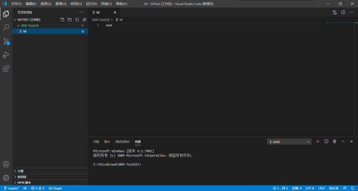

  
这时，就相当于你在工作区进行了一些列操作，并最后得到满意文件，随后我们就要开始上传了。  
我们首先把该文件上传到暂存区：

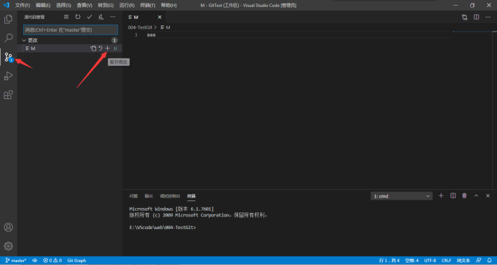

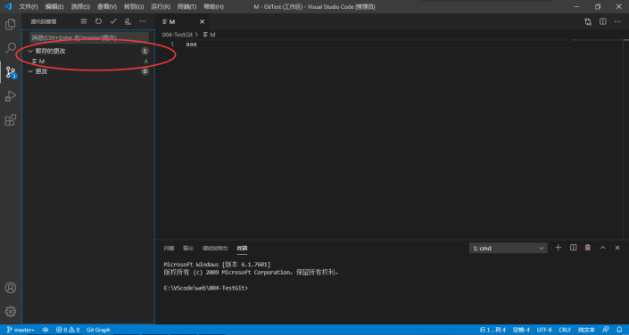

随后，让我们把暂存区的文件进行提交，这时，会弹出让你描述你提交了什么的对话框，也就是消息：

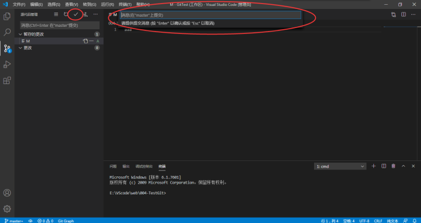

让我们对我们进行了什么操作进行一些描述，很明显，我们把一个M文件创建到了M分支上，所以我们描述成：add M to M。添加M文件到M分支：

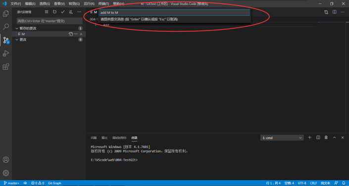

此时M文件就成功的提交到了M分支上，在我们进行完一些列的操作后，让我们打开已经安装好了的Git Graph插件，来看看我们做了些什么：

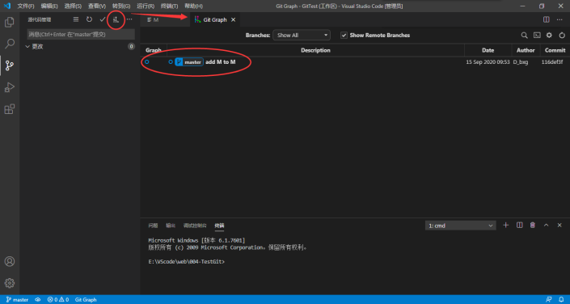

让我们给这个操作添加一个标签，用标签来标明版本号，此处就是我们的v0.1：

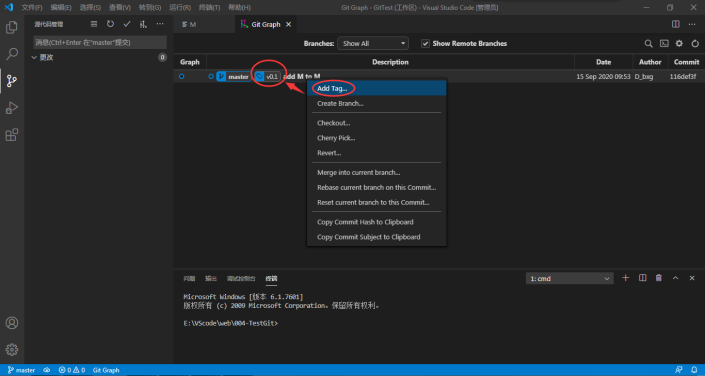

#### 4.4.5

此时，我们想继续开发，但又怕诸如：项目添加的功能可能不完善，但我们又很难记录一个功能没开发完，因此，我们把功能的开发，从M分支分出去，到D分支。

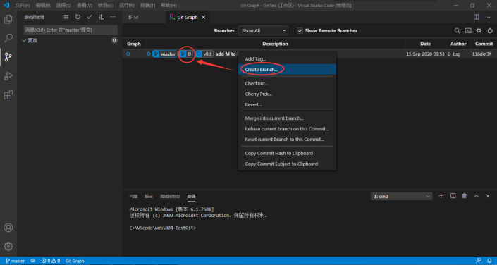

好，让我们切换到D分支，并且开发出了D文件：

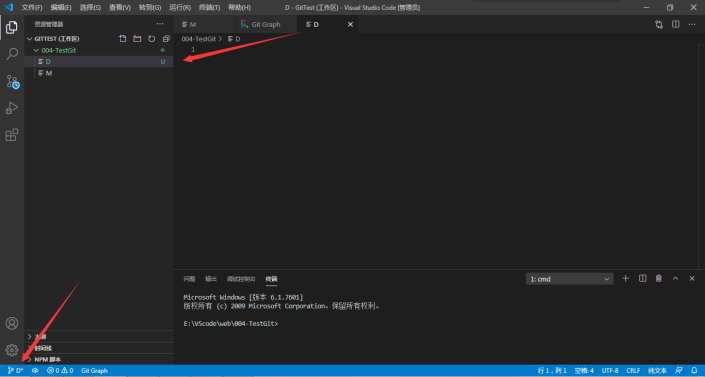

并且上传到了D分支，添加了add D to D的描述

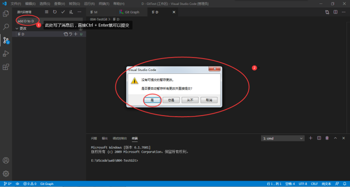

如上所述，我们的功能开发，都在D这条分支上进行，而特性的开发，应当在F1、F2分支上开发，F1就是1号特性，当然，我们实际项目开发时，1应当换成特性名称，如：F\_changeName，就是指换名字特性的开发，但此处，我们使用F1。还要注意的是，特性分支，应该从开发分支分出去，而并非M分支，这很好理解，M是整个项目，一版一版的迭代，而特性，是功能一版一版的迭代。

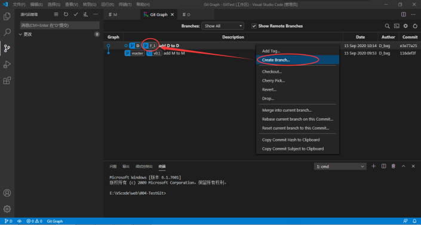

我们切换到F1分支，并进行F1分支特性的开发：

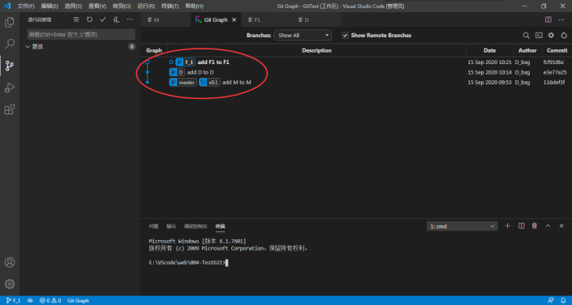

这时候，我们发现F1功能不完善，又进行了修改，和提交：

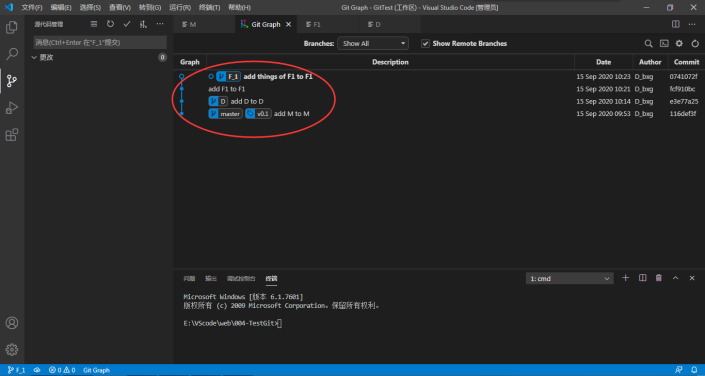

这时，我们认为F1功能开发完成了，我们把F1功能加入到D分支中去，同时我们把标签完善好，此后的每一层提交，都应当在标签上注明版本。**值的注意的是，合并分支，我们首先要把当前所在分支切换到D，再把F1合并到D上：**

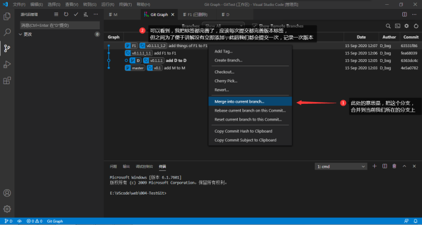

提交完成的样式为这样：

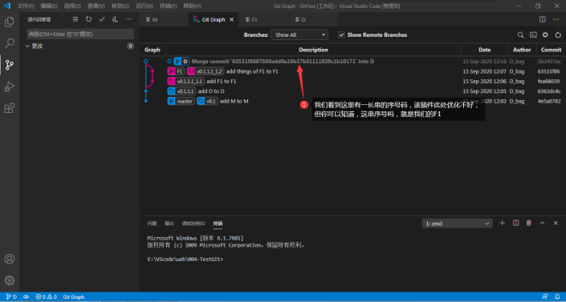

#### 4.4.6

此时，我们又想开发F2、F3特性：

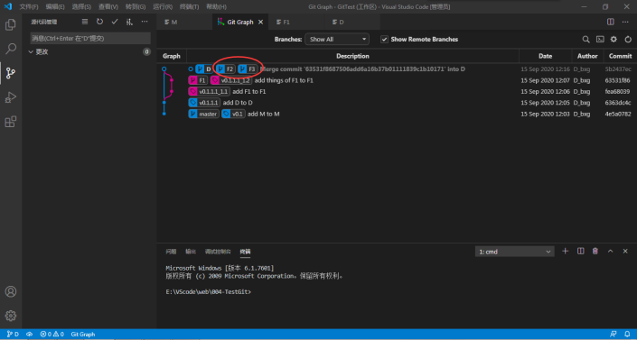

很明显，和开发F1同样，在我们把F2，F3特性完善后，我们把F2，F3合并到D中去，尽管看起来不那么美观，但效果是显著的，我们每添加一个特性，就应当记录一次合并。如下图：

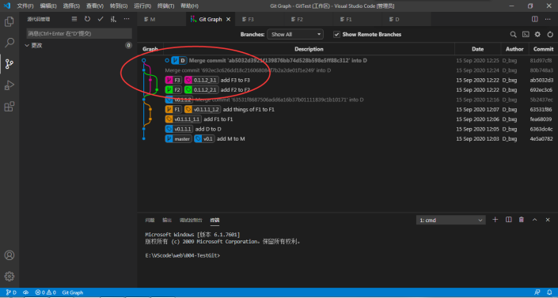

#### 4.4.7

我们看到，如此一来，我们的D就添加了F1,2,3个特性，至此，我们认为D开发完成，如果我们认为D的功能足够使用，就直接发布到M分支：

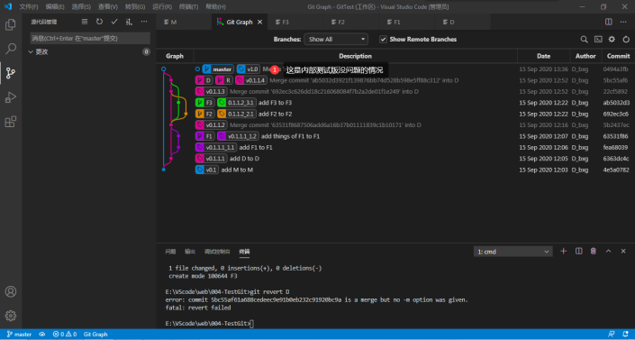

但如果，我们发现当前的D分支上的开发版有问题，我们就应当创建R分支，来修改D，与F分支不同的是，F是用来添加新特性，而R则是修改D出现的问题，如果修改了几版就可以发布，则直接发布：

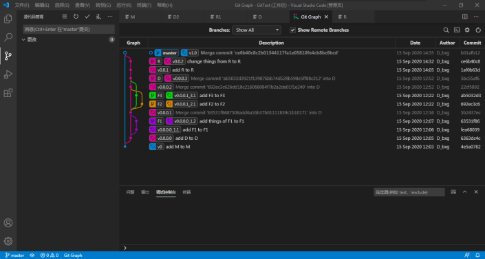

若问题太多，要回去再次开发，然后再次发布内部测试版，然后发布到M分支，如图所示：

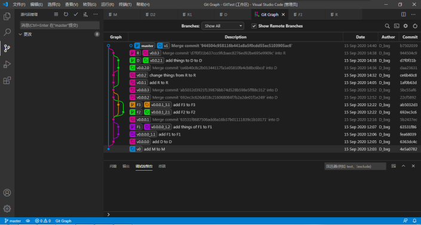

若此时，出现紧急Bug，则不必回炉，而是在M分支上开H分支，用于修改紧急Bug：

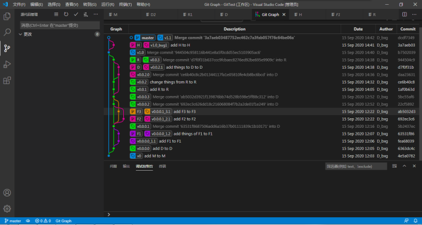

#### 4.4.8

在第一版本发布后，我们就可以继续开发我们的第二版了：

## 5 ****对于案例的一些解释和补充

### 5.1 一些解释

在看完上面的Git说明与案例后，你现在应当能使用Git轻松的管理自己本地项目。但仍旧有一些要进行解释。可以看到，我最后一幅图的标签与前面几个步骤的标签出现了差池，是因为笔者在写该案例时，还未理清标签的使用方式，而是在撰写该文档时，才想清楚标签用法，因此，**最后一幅图的标签为正确标签**。

对于标签进行一些解释：

**v 版本号 . bug号 . 内部测试版号 . 开发版号 \_** **特性 号/名称 . 特性版本号**  _**\_**_ **bug漏洞号 . 漏洞版本号**

例如最后一幅图的F3分支的版本号就是：

第 **0** 版本，第 **0** bug，第 **0** 内部测试版，第 **1** 开发版\_第 **3** 号特性，第三号特性的第 **1** 版

因此是：

**v0.0.0.1\_3.1**

你可以看到，我并没有把标签拿出来单讲，是因为我认为贴标签这个过程，是符合人的正常思维的，单拉出来讲，反而会给人一种这是新东西的错觉。

### 5.2 一些补充

在根据上案例进行本地的Git管理后，作用应当是巨大的，因为你可以随意修改你的源文件，并且清楚知道自己分别作了些什么。若出现不好修改的问题，也完全可以对比两者区别，或直接回滚到上一版本。

**至此，你就完成了用Git管理本地项目的全部内容，你可以随心所欲的使用Git来管理自己的本地项目了，恭喜你！**

