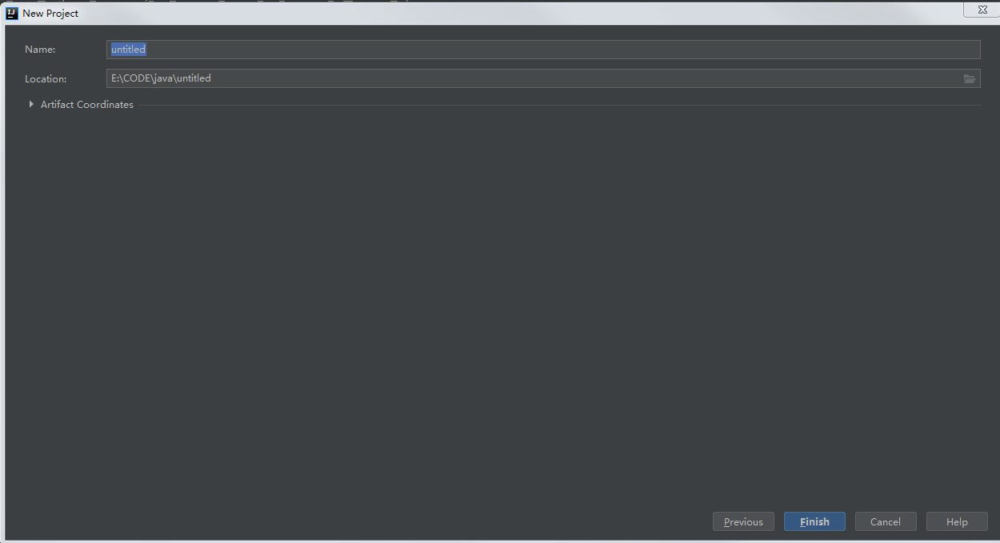

# Idea中创建一个maven项目

我们首先使用maven创建一个project后，首先需要填写name。



name作为整个项目的name，在下方Artifacts coordinate中的name作为模块（modules）的name。

而com.bxg后面要不要缀上模块名称，目前我也不清楚（2020年12月3日15:53:22）

查阅资料得知，com.bxg后面接项目名称，例如：com.bxg.saleor、或者：com.bxg.jdbc-search

（2020年12月3日16:19:46）： 我们在填写group in时，写的com.bxg.项目名称，应该和在main\java\后面写的com.bxg.项目名称一致。参考来源：[Idea中使用maven创建Servlet](https://blog.csdn.net/huweiliyi/article/details/107637785)

此外，还另外研究了下命名方法：[命名规范](https://zhuanlan.zhihu.com/p/128092551)、[前端命名规范](https://zhuanlan.zhihu.com/p/137065620)

总结下来，在文件夹、或者其他不是java需要使用驼峰命名时，都使用连字符：-。除了必须使用\_的场合，否则都使用连字符。但仍旧有一些问题：多个单词相互连接，并表达语义时如何靠连字符表达。

目前来讲，只能既使用连字符，又使用驼峰。如：jdbc-SearchName。（2020年12月3日16:09:40）

（2020年12月6日14:42:47） 目前比较清晰了，com.bxg后面的写project，而name也一般使用project，在定义com.bxg后面不写project。如果写了project，那么下面的artifact就作为project下层的小project。

## [idea中创建多module的maven工程](https://blog.csdn.net/sinat_30160727/article/details/78109769)

对spring boot中，又有core、又有其他有参考意义。

## maven中的命名问题

### 0. idea中的maven命名问题

### 1. 单模块开发-目录结构

```text
 project
     pom.xml(G: com.bxg.project; A: project)
     main
         java
             src
                 com.bxg.project
                     service方法
                     po存放的是javaBean
                     controller路由
                     dao存放的是用于操作数据库的SQL语句
                     common
         sourse
     test
```

### 2. 多模块开发-目录结构

```text
 project
     pom.xml(G: com.bxg.project; A: project)
     project-parent
     project-cloud
     project-admin
     project-stater
         pom.xml(G: com.bxg.project; A: project-stater)
         project-stater-core
             pom.xml(G: com.bxg.project; A: project-stater-core)
             main
                 java
                     com.bxg.project.stater.core
                         base是项目的基础核心，定义一些基础类，如BaseController、BaseService等；
                             service方法
                             po存放的是javaBean
                             controller路由
                             dao存放的是用于操作数据库的SQL语句
                             common
                         cache是缓存相关；
                         config是配置中心，模块所有的配置放到config里统一管理；
                         constants里定义系统的常量。
                         exception里封装一些基础的异常类；
                         system是系统模块；
                         util里则是一些通用工具类；
         project-stater-cache
         project-stater-security
```

参考：

[Maven项目命名规范（groupID、artifactid）](https://blog.csdn.net/qq_19934363/article/details/97612169)

[maven中GroupID 和ArtifactID怎么写](https://www.cnblogs.com/panxuejun/p/6184072.html)

[Maven项目命名规范](https://blog.csdn.net/limm33/article/details/60959044)

[Maven中子模块继承父模块的两种方式](https://blog.csdn.net/qq_42449963/article/details/105405247)

[Maven 中如何管理多模块项目的依赖关系](https://nezha.github.io/%E5%BC%80%E5%8F%91%E5%B7%A5%E5%85%B7/2018-11-07-Maven%E4%B8%AD%E5%A6%82%E4%BD%95%E7%AE%A1%E7%90%86%E5%A4%9A%E6%A8%A1%E5%9D%97%E9%A1%B9%E7%9B%AE%E7%9A%84%E4%BE%9D%E8%B5%96%E5%85%B3%E7%B3%BB/)

[Maven 多模块管理](https://juejin.cn/post/6844903970024980488)

